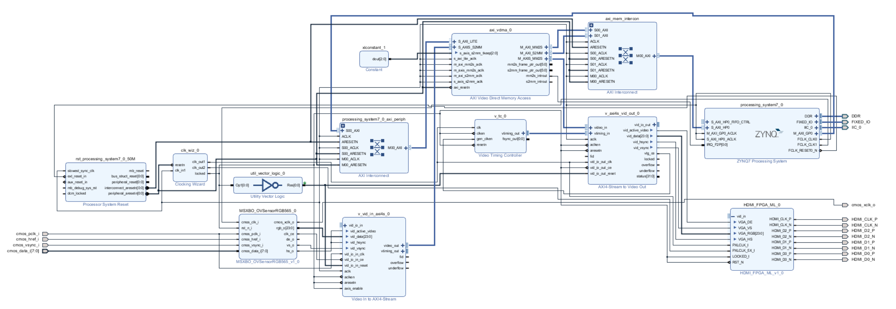

# OV5640_VDMA_HDMI

This project is based on the ZYNQ series development board PYNQ Z1. The project is based on Xilinx Vivado's development platform and constructs a video processing system for ov5640 camera acquisition and HDMI output through VDMA IP

## Hardware 

The main system framework diagram is shown below:

## Software

Implemented I2C dynamic configuration  for ov5640 and VDMA base configuration.

## Application 
If you want to use this project as your own personalized project , you need:

+ Add my_ip (User defined) IP package to path , download and install vivado-library IP package(Xilinx Official)

+ Add your own processing system in the block design

+ Modify the constraint file (xdc) based on your hardware environment
